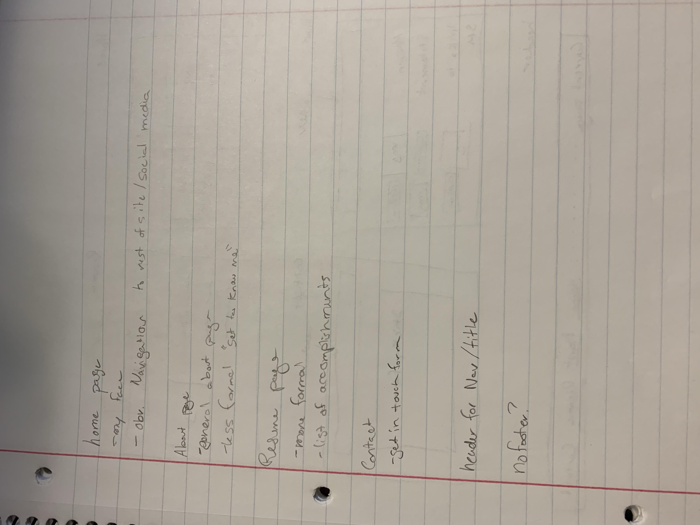
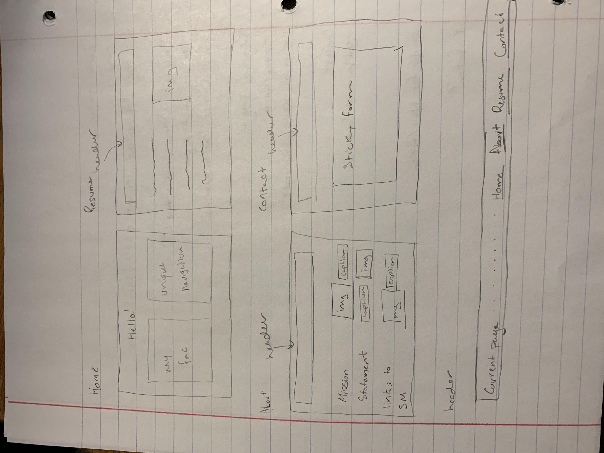
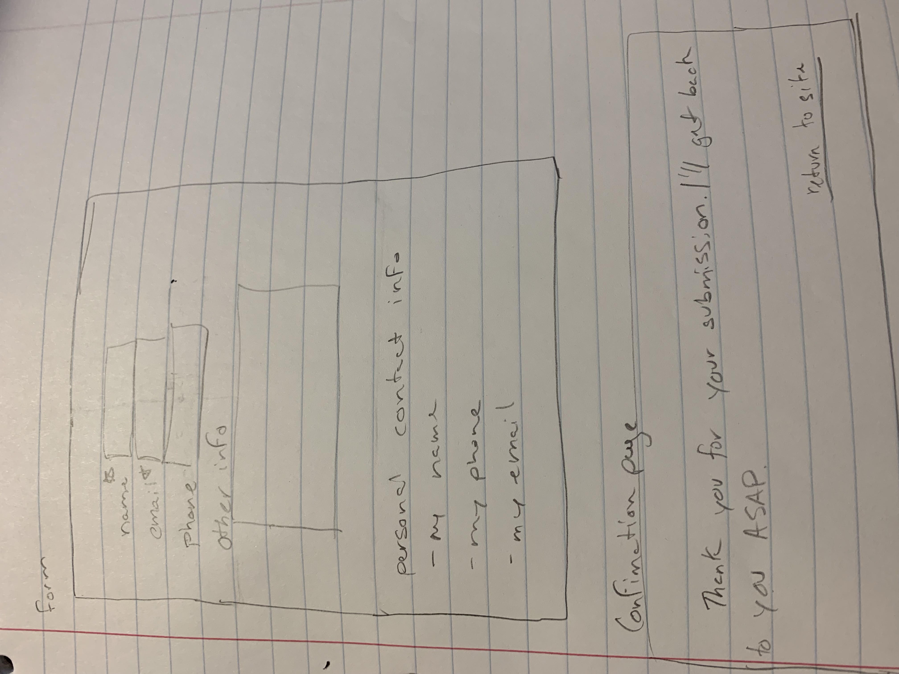

# Project 1: Design Journey

Your Name: [Sean Brooks]

**All images must be visible in Markdown Preview. No credit will be provided for images in your repository that are not properly linked in Markdown. Assume all file paths are case sensitive!**

## Markdown (DELETE ME)

[**Delete this markdown instructions section before you submit your final assignment.**]

This is a Markdown file. All written documents that you will submit this semester will be Markdown files. Markdown is a commonly used format by developers and bloggers. It's something that you should know.

The following links are Markdown references:
* <https://guides.github.com/features/mastering-markdown/>
* <https://github.com/adam-p/markdown-here/wiki/Markdown-Cheatsheet>

When writing your Markdown file in VS Code. Open the command palette and search for **Markdown: Open Preview**. This will open up a panel in Code where you can preview your formatted Markdown file.

This is how your insert images into your Markdown documents:

[**Delete this markdown instructions section before you submit your final assignment.**]

# Project 1, Milestone 1 - Design & Plan

## Website Topic

[Tell us what your website is about. What are you promoting?]
    I will be designing a professionsal personal website that I will use and maintain in the future.

## Target Audiences

[Tell us about your two target audiences.]
    Target audiences will include potential/future employers who I will refer to the website in the interview process as a showcase of my own work, as well as the content in the website as a portfolio.
    The website should also appeal to recruiters who may be looking at me for future consulting work

## Design Process

[Document your design process. Show us your sketches. Show us your card sorting. Show us the evolution of your design from your first idea (sketch) to design you wish to implement (sketch). Show us the process you used to organize content and plan the navigation (card sorting).]

[Thoroughly document this process. The _process_ is the important part of this assignment, not the final result.]

## Final Design Plan

[Include sketches of your final design here. Don't forget to design the form and its confirmation page!]

[Include your site navigation here. Describe the content on each page. Tip: use bulleted lists.]

## Target Audiences' Needs

[Tell us how your design meets the needs of both of your target audiences.]
The primary goal of the website is to be accesible and well organized. It is essential that any recruiter and any employer can navigate the website easily and find what they need. I also want the website to be professional and clean - while the website showcases my work it is also part of my work and as such must be very well done.

## Templates

[Now that you've finalized your design, identify the templates you will use on your site.]
I will use a header template for the navigation and page name. This header will be on 3 of the 4 pages of my website. I do not believe a footer is neccessary for this website, nor will there be any other templates.

# Project 1, Milestone 2 - Draft Website

## Sticky Form

[What fields are required for your form?]

[Plan out your error messages for your target audiences here.]

Name and email will both be required. There will also be an optional "notes" field.

## Validation Code Plan

[Write out your pseudocode plan for handling the validation of the form.]

if name is empty print name error. Next, if email is empty or not a valid email (no @ sign) print the email error. If both name and email are filled in correctly, validate.

# Final Submission: Complete & Polished Website

## Target Audiences

[Tell us how your final site meets the needs of the target audiences. Be specific here. Tell us how you tailored your design, content, etc. to make your website usable by both target audiences.]

I kept the website simple and well organized. Really, the website's major purpose is a means for recruiters and employers to get in touch with me, so the form and the footer are the two most important parts. I used simple shapes and a non-distracting, mildly textured background to give the site a little character without looking unprofessional.

## Reflection

[Take this time to reflect on what you learned during this assignment. How have you improved from 1300? What things did you have trouble with?]
I definitely had less trouble with the actual coding of the html and CSS of the website. Having the labs done and learning through the labs helped with the trickier parts of the php. I still think I'm pretty lacking in making a super astetically appealing site (I don't have the eye for it), so I decided to just keep it simple.
